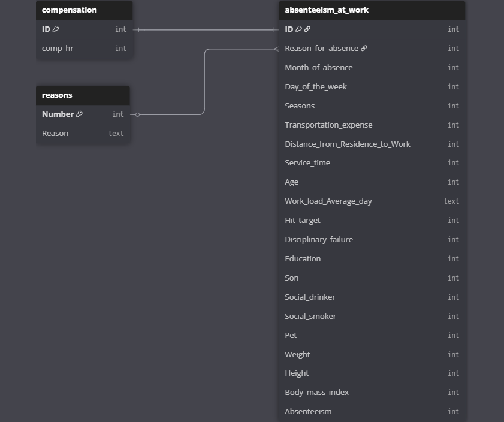

# HR Absenteeism Data Analysis 2024

# Project Background
The HR department is looking to find patterns in the employee's health metrics and using a budget of $983,221 to desperse it amoung the employees that are non-smokers and a total budget of $1000 for "healthy" individuals & with low absenteeism.

Along with giving the healthy employees a bonus for the year from the budgeted amount, HR is also looking to understand absenteeism at work.

Insights and recommendations are provided on the following key areas:

- **Provide a list of Healthy individuals & low absenteeism for the healthy bonus program of $1000** 
- **Calculate a wage increase or annual compensation for non-smokers** 
- **Find the average hours of work missed by BMI category** 
- **Identify what season has the most absentees** 

Targed SQL queries regarding various business questions can be found here [link](
).

An interactive Tableau dashboard used to report and explore sales trends can be found here [link](https://public.tableau.com/shared/4DKQ9S6RS?:display_count=n&:origin=viz_share_link).

# Data Structure & Initial Checks

The companies main database structure as seen below consists of three tables: reasons, compensation, absenteeism_at_work, with a total row count of 1,509 records. A description of each table is as follows:

- **reasons:** Holds a description of the reason for an absence based on the reason's ID.
- **compensation:** Has an employee's ID and how much the employee makes an hour
- **absenteeism_at_work:** Holds the majority of the company's employee health information and absence data.

# Executive Summary

### Overview of Findings

Based on the findings, on average the healthy and overweight health categories have the highest amount of absentee hours per year on average by approximately 55%. 

There were 111 employees that met the criteria for getting the $1000 compensation from the healthy employee bonus of having a BMI < 25, non-smoker, non-drinker, absences < avg(absences).

There were 686 employees that were marked as non-smokers. Between those 686 employees the total hours they work for the year 1,426,880, and with a budgeted $983,221 split amongst the group as a bonus for the year or as an addition to their hourly compensation it would be $1,433.26 for the year or $0.68 added to their hourly wage.

The two seasons that produce the most absences appear to be the spring followed by summer.

The top 3 reasons for absences were medical consultation (20.14%), dental consultation (15.14%), and physiotherapy (9.32%).

# Insights Deep Dive
### Budgeted compensation increase & bonus:

* **Non-Smokers** - Out of the 740 employees, there were 686 that were concidered non-smokers. This means that over 90% of the employees are non-smokers and are eligible for a compensation increase of $0.68 to their hourly wage for the year or $1,433.26 as a one time payment.
  
* **Healthiest Employees** - 111 employees are at a BMI that is below 25, non-smoker, non-drinker, and has a number of absentee hours that is less than the average for the whole company. These employees will be eligible for the $1000 bonus. This group of employees made up 15% of the company.

### Main reasons for absences:

* **Top 3 reasons for absences** - The top 3 reasons that employees have reported for their absence hours are medical consultation (20.14%), dental consultation (15.14%), and physiotherapy (9.32%) with the rest of the 26 reasons making up far less of the total hours.

# Recommendations:

Based on the insights and findings above, we would recommend the HR team to consider the following: 

* The HR team should look into. **There is enough coverage during the seasons with the highest number of absentee hours**
